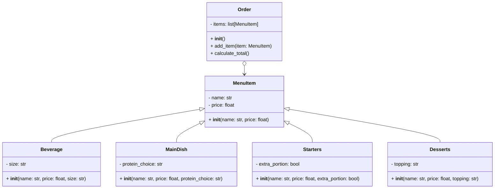

# POO_reto_03 Rectangulo y Restaurante

## Ejercicio 1: Clases Geométricas

### Descripción
Se implementaron varias clases geométricas para representar entidades como puntos, líneas, rectángulos y cuadrados. Estas clases permiten realizar cálculos de distancias, pendientes, áreas, perímetros y verificar intersecciones.

### Código
```python
class Point:
    definition: str = "Entidad geometrica abstracta que representa una ubicación en un espacio."
    def __init__(self, x: float=0, y: float=0):
        self.x = x
        self.y = y

    def move(self, new_x: float, new_y: float):
        self.x = new_x
        self.y = new_y

    def reset(self):
        self.x = 0
        self.y = 0

    def compute_distance(self, point: "Point") -> float:
        distance = ((self.x - point.x)**2+(self.y - point.y)**2)**(0.5)
        return distance


class Rectangle:
    def __init__(self, bottom_left_corner: Point, height: float, width: float):
        self.height = height
        self.width = width

    def compute_area(self) -> float:
        return self.height * self.width

    def compute_perimeter(self) -> float:
        return 2 * (self.height + self.width)


class Square(Rectangle):
    def __init__(self, bottom_left_corner: Point, side_length: float):
        super().__init__(bottom_left_corner, height=side_length, width=side_length)

    def compute_interference(self, point: Point) -> bool:
        inside_x = self.x <= point.x <= self.x + self.width
        inside_y = self.y <= point.y <= self.y + self.height
        return inside_x and inside_y


class Line:
    def __init__(self, start: Point, end: Point):
        self.start = start
        self.end = end

    def compute_length(self) -> float:
        return (((self.end.y - self.start.y)**2) + ((self.end.x - self.start.x)**2))**0.5

    def compute_slope(self):
        if self.end.x == self.start.x:
            return 'La linea es vertical'
        elif self.end.y == self.start.y:
            return 'La linea es horizontal'
        return (self.end.y - self.start.y) / (self.end.x - self.start.x)

    def compute_horizontal_cross(self) -> bool:
        return (self.start.y <= 0 and self.end.y >= 0) or (self.end.y <= 0 and self.start.y >= 0)

    def compute_vertical_cross(self) -> bool:
        return (self.start.x <= 0 and self.end.x >= 0) or (self.end.x <= 0 and self.start.x >= 0)


class Rectangle_Lines:
    def __init__(self, bottom_left_corner: Point, height: float, width: float):
        self.height = height
        self.width = width

        # Definir los puntos
        self.bottom_left_corner = bottom_left_corner
        self.top_left_corner = Point(bottom_left_corner.x, bottom_left_corner.y + height)
        self.top_right_corner = Point(bottom_left_corner.x + width, bottom_left_corner.y + height)
        self.bottom_right_corner = Point(bottom_left_corner.x + width, bottom_left_corner.y)

        # Definir los segmentos del rectángulo
        self.line1 = Line(self.bottom_left_corner, self.bottom_right_corner)
        self.line2 = Line(self.bottom_left_corner, self.top_left_corner)
        self.line3 = Line(self.bottom_right_corner, self.top_right_corner)
        self.line4 = Line(self.top_left_corner, self.top_right_corner)

    def compute_area(self) -> float:
        return self.height * self.width

    def compute_perimeter(self) -> float:
        return 2 * (self.height + self.width)
```


---

## Escenario: Sistema para Restaurante

### Descripción
Este sistema modela un menú de restaurante con diferentes categorías de ítems (bebidas, platos principales, entradas y postres). También permite la creación de pedidos, calcular el total de la cuenta y aplicar reglas específicas según el tipo de ítem en el menú.

### Funcionalidades Principales
1. **Clases del Menú:**
   - **MenuItem:** Clase base con atributos `name` y `price`.
   - **Beverage:** Clase para bebidas, con el atributo adicional `size` y ajustes de precio según el tamaño.
   - **MainDish:** Clase para platos principales, con el atributo adicional `protein_choice` y ajustes de precio según el tipo de proteína.
   - **Starters:** Clase para entradas, con el atributo adicional `extra_portion` que ajusta el precio si se solicita una porción extra.
   - **Desserts:** Clase para postres, con el atributo adicional `topping` que ajusta el precio dependiendo del topping seleccionado.

2. **Clase de Pedido:**
   - **Order:** Contiene una lista de ítems (`MenuItem`) y permite:
     - Agregar ítems al pedido.
     - Calcular el total de la cuenta considerando las reglas de precio específicas.

3. **Diagrama de Clases:** Incluido para representar visualmente las relaciones entre las clases.

### Código
```python
class Order:
    def __init__(self):
        self.items = []

    def add_item(self, item):
        if isinstance(item, MenuItem):
            self.items.append(item)

    def calculate_total(self):
        return sum(item.price for item in self.items)


class MenuItem:
    def __init__(self, name: str, price: float):
        self.name = name
        self.price = price


class Beverage(MenuItem):    
    def __init__(self, name, price, size: str = 'Normal'):
        if size.upper() == 'GRANDE': 
            price += 1000
        elif size.upper() == 'PEQUEÑO': 
            price -= 1000
        super().__init__(name, price)
        self.size = size.upper()


class MainDish(MenuItem):
    def __init__(self, name: str, price: float, protein_choice: str = 'chicken'):
        if protein_choice.upper() == 'BEEF': 
            price += 3000
        elif protein_choice.upper() == 'SEAFOOD': 
            price += 2500
        super().__init__(name, price)
        self.protein_choice = protein_choice.upper()


class Starters(MenuItem):
    def __init__(self, name: str, price: float, extra_portion: bool = False):
        if extra_portion: 
            price += 2000
        super().__init__(name, price)
        self.extra_portion = extra_portion


class Desserts(MenuItem):
    def __init__(self, name: str, price: float, topping: str = 'none'):
        if topping.upper() == 'CHOCOLATE': 
            price += 500
        elif topping.upper() == 'CARAMEL': 
            price += 1000
        elif topping.upper() == 'NUTS': 
            price += 1200
        super().__init__(name, price)
        self.topping = topping.upper()
````

### Diagrama de Clases

